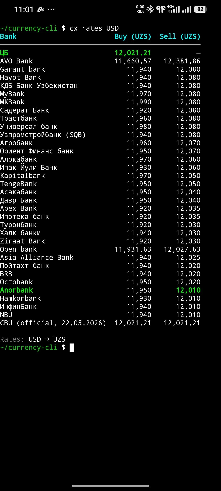
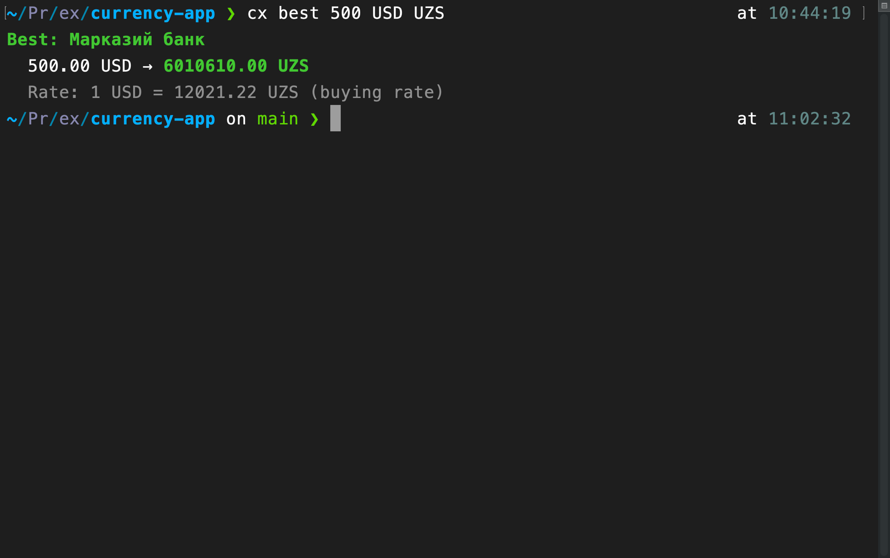

# cx — Valyuta kurslari CLI

Uzbekiston banklari va Markaziy bank kurslarini terminaldan ko'rish va konvertatsiya qilish vositasi. macOS, Linux va Android Termux da ishlaydi.

## Ko'rinishi

| Termux (Android) | Mac Terminal |
|------------------|--------------|
|  |  |

**Manbalar:**
- [onmap.uz](https://onmap.uz) — tijorat banklari kursi (kuniga 4 marta yangilanadi)
- [cbu.uz](https://cbu.uz) — Markaziy bank rasmiy kursi (kunlik)

---

## O'rnatish

### Mac / Linux

Eng oson — `go install` (clone qilish shart emas):

```bash
go install github.com/mfs1011/currency-cli/cmd/cx@latest
```

Binary `~/go/bin/cx` ga o'rnatiladi. `~/go/bin` PATH'da bo'lishi kerak:

```bash
echo 'export PATH="$HOME/go/bin:$PATH"' >> ~/.zshrc
source ~/.zshrc
```

Yoki manbadan build qilish:

```bash
git clone https://github.com/mfs1011/currency-cli.git
cd currency-cli
go build -o cx ./cmd/cx
sudo mv cx /usr/local/bin/
```

### Android — Termux

Ikki yo'l bor. **1-yo'l osonroq** (Termuxning o'zida build qilish).

---

#### 1-yo'l: Termuxning o'zida build qilish (tavsiya)

Telefonda Termux ilovasini oching va quyidagilarni ketma-ket kiriting:

```bash
# 1. Go o'rnatish
pkg update
pkg install golang git

# 2. Loyihani yuklab olish
git clone https://github.com/mfs1011/currency-cli.git
cd currency-cli

# 3. Build qilish
go build -o cx ./cmd/cx

# 4. Istalgan joydan ishlatish uchun PATH ga qo'shish
mkdir -p ~/bin
mv cx ~/bin/cx
echo 'export PATH="$HOME/bin:$PATH"' >> ~/.bashrc
source ~/.bashrc
```

Tekshirish:

```bash
cx rates USD
```

> **Eslatma:** `pkg install golang` ~150 MB yuklab oladi. Wi-Fi orqali qiling.

---

#### 2-yo'l: Macda build qilib, Telegramga yuborish

Agar telefonda Go o'rnatmasangiz — Macda binary yasab, Telegramga yuboring.

**Mac da (terminal):**

```bash
cd currency-cli
make linux-arm64
# dist/cx-linux-arm64 fayli yaratiladi
```

Faylni **o'zingizga Telegramda yuboring** (Saved Messages).

**Telefondan Termux da:**

```bash
# 1. Telegram ilovasidan faylni yuklab oling
#    (odatda /storage/emulated/0/Download/ ga tushadi)

# 2. Termuxga storage ruxsatini bering (birinchi marta)
termux-setup-storage

# 3. Faylni ko'chiring va o'rnating
mkdir -p ~/bin
cp ~/storage/downloads/cx-linux-arm64 ~/bin/cx
chmod +x ~/bin/cx

# 4. PATH ga qo'shish
echo 'export PATH="$HOME/bin:$PATH"' >> ~/.bashrc
source ~/.bashrc
```

Tekshirish:

```bash
cx rates USD
```

---

## Buyruqlar

### `cx rates [VALYUTA]`

Barcha banklardan kurs jadvalini ko'rsatadi.

```bash
cx rates          # USD (standart)
cx rates EUR
cx rates RUB
```

Natija:

```
Bank                        Buy (UZS)    Sell (UZS)
----------------------------------------------------
MKBank                         11,990       12,080
Kapitalbank                    11,970       12,050
Aloqabank                      11,970       12,060
...
CBU (official, 22.05.2026)     12,021       12,021
```

Eng yaxshi kurs **yashil** rang bilan ajratiladi.

---

### `cx convert MIQDOR FROM TO`

Har bir bankdagi konvertatsiya natijasini ko'rsatadi.

```bash
cx convert 100 USD UZS
cx convert 1000000 UZS USD
cx convert 50 EUR RUB      # CBU orqali hisoblaydi
```

Natija (buy / sell formatida):

```
Bank                     100.00 USD → UZS
------------------------------------------
MKBank          1,199,000 UZS / 1,208,000 UZS
Kapitalbank     1,197,000 UZS / 1,205,000 UZS
...
CBU (official)  1,202,122 UZS / 1,202,122 UZS
```

> **buy** — siz chet el valyutasini bankka sotasiz (bank sotib oladi)
> **sell** — siz chet el valyutasini bankdan sotib olasiz

---

### `cx best MIQDOR FROM TO`

Eng qulay kursni taklif qiluvchi bankni topadi.

```bash
cx best 100 USD UZS
cx best 1000000 UZS USD
```

Natija:

```
Best: Anorbank
  100.00 USD → 1,199,000 UZS
  Rate: 1 USD = 11990.00 UZS (buying rate)
```

---

## Offline rejim

Internet bo'lmasa, oxirgi saqlangan ma'lumotdan foydalanadi:

```
offline: using cached data from 2026-05-23 09:35
```

Cache joylashuvi: `~/.cx/cache.json`
- onmap.uz ma'lumotlari: 5 daqiqa saqlanadi
- CBU ma'lumotlari: 24 soat saqlanadi

---

## Barcha platformalar uchun build

```bash
make build-all
```

Yaratilgan fayllar `dist/` papkasida:

| Fayl | Platform |
|------|----------|
| `cx-linux-amd64` | Linux (PC) |
| `cx-linux-arm64` | Linux ARM / Android Termux |
| `cx-darwin-amd64` | macOS (Intel) |
| `cx-darwin-arm64` | macOS (Apple Silicon) |
| `cx-windows-amd64.exe` | Windows |

---

## Loyiha tuzilmasi

```
currency-cli/
├── Makefile
├── cmd/
│   └── cx/
│       └── main.go      # entry point
└── internal/
    ├── cli/
    │   ├── root.go      # CLI asosi (cobra)
    │   ├── rates.go     # cx rates
    │   ├── convert.go   # cx convert
    │   ├── best.go      # cx best
    │   └── currencies.go # cx currencies
    ├── api/
    │   ├── onmap.go     # onmap.uz API
    │   └── cbu.go       # cbu.uz API
    ├── cache/
    │   └── cache.go     # TTL cache
    ├── config/
    │   └── config.go    # ~/.cx/ papkasi
    └── display/
        └── table.go     # jadval va rang
```

---

## Talablar

- Go 1.21+ (qurishda)
- Internet ulanishi (yoki cache)
- Termux uchun: faqat ARM64 binary kerak, Go shart emas

---

## Keyingi versiya (v2) rejalari

- `cx history USD UZS --days 7` — ASCII grafik
- `cx watch USD UZS --above 12500` — kurs ogohlantirishi
- `cx calc "100 USD + 50 EUR" UZS` — aralash hisoblash
- `cx source add` — o'z manbangizni qo'shish
